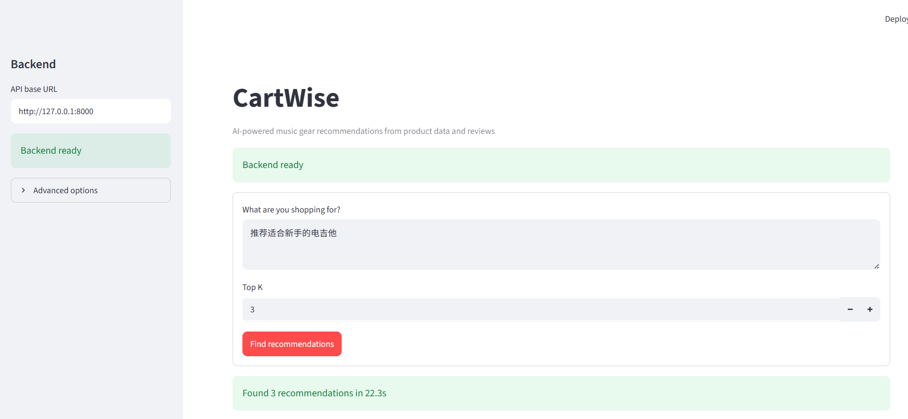
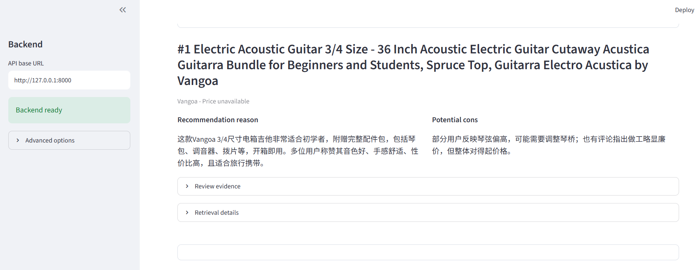

# CartWise - 可解释电商导购推荐系统

CartWise 是一个基于 FastAPI + Streamlit 的乐器电商自然语言推荐 MVP。

用户输入购物需求后，系统会进行意图解析、混合召回、融合排序、结构化过滤，并从商品评论中检索证据，生成带评论依据的中文推荐理由和潜在缺点。

---

## 项目截图

### Streamlit 推荐界面



### 推荐结果与评论证据



---

## 架构

```text
用户需求
  -> LLM 查询翻译 / 意图解析
  -> BM25 + Dense + LightGCN + Popularity 召回
  -> 硬过滤
  -> Weighted RRF 融合排序
  -> 最终推荐商品
  -> Review Evidence RAG
  -> 推荐理由 / 潜在缺点
  -> FastAPI
  -> Streamlit
```

---

## 功能

- 中文自然语言购物需求输入
- LLM 查询翻译与意图解析
- BM25 关键词召回
- Dense 向量召回
- LightGCN 个性化召回
- Popularity 冷启动召回
- Weighted RRF 多路召回融合
- 价格、品牌、颜色、材质等硬过滤
- 基于商品评论的 Evidence RAG
- 推荐理由和潜在缺点生成
- FastAPI 后端接口
- Streamlit 前端页面

---

## 技术栈

- Frontend: Streamlit
- Backend: FastAPI, Uvicorn
- LLM: OpenAI
- Vector DB: Qdrant
- Retrieval: BM25, Dense Retrieval
- Recommendation: LightGCN, Popularity
- RAG: LangChain
- Data: Amazon Reviews 2023 `Musical_Instruments`
- ML: PyTorch, PyTorch Geometric
- Test: pytest

---

## Quick Start

如果只是查看代码结构或运行不依赖真实数据的测试，可以先完成 Python 环境安装。

```powershell
git clone https://github.com/aqwddda/cartwise-recrag.git
cd CartWise
```

设置虚拟环境：

```powershell
python -m venv .venv
.\.venv\Scripts\activate
```

安装依赖:

```powershell
python.exe -m pip install -r requirements.txt
```

运行测试：

```powershell
python.exe -m pytest -q
```

注意：这一步不能直接跑完整推荐系统。完整链路还需要本地数据、Qdrant 向量 collection、BM25 索引、LightGCN checkpoint 和 LLM API Key。

---

## Full Local Setup

本仓库不提交原始数据、向量索引、模型权重、Qdrant storage 或 API Key。完整运行推荐链路前，需要先准备以下本地产物：

- Amazon Reviews 2023 `Musical_Instruments` 原始数据
- 预处理后的商品、评论和交互数据
- BM25 商品索引
- Qdrant 商品向量 collection
- Qdrant 评论证据 collection
- LightGCN checkpoint
- OpenAI-compatible LLM API Key

### 1. 启动 Qdrant

可以使用 Docker 启动本地 Qdrant：

```powershell
docker run -p 6333:6333 qdrant/qdrant
```

如果你使用本地持久化 storage，请确认该目录不要提交到 Git。

### 2. 配置环境变量

本项目当前使用 [DeepSeek API](https://api-docs.deepseek.com/) 作为 OpenAI-compatible LLM 服务。在项目根目录创建 `.env` 文件：

```text
QDRANT_URL=http://127.0.0.1:6333
DEEPSEEK_API_KEY=your_key_here
DEEPSEEK_BASE_URL=https://api.deepseek.com
DEEPSEEK_MODEL=deepseek-v4-flash
```

也可以使用通用 OpenAI-compatible 配置：

```text
OPENAI_COMPATIBLE_API_KEY=your_key_here
OPENAI_COMPATIBLE_BASE_URL=https://your-provider.example.com
OPENAI_COMPATIBLE_MODEL=your-model-name
```

不要提交 `.env`、API Key、数据文件、模型权重或 Qdrant 存储目录。

### 3. 准备数据

将 Amazon Reviews 2023 `Musical_Instruments` 数据放到本地数据目录后，运行预处理脚本：

```powershell
.\.venv\Scripts\python.exe -m scripts.pipeline.preprocess_amazon_reviews
.\.venv\Scripts\python.exe -m scripts.pipeline.build_dev_sample
```

### 4. 构建商品索引

构建 BM25 商品索引：

```powershell
.\.venv\Scripts\python.exe -m scripts.pipeline.build_product_bm25_index --scope full
```

构建 Dense 商品向量 collection：

```powershell
.\.venv\Scripts\python.exe -m scripts.pipeline.build_product_dense_index --scope full --models e5 --recreate
```

默认商品 Dense collection 名称形如：

```text
cartwise_products_full_e5_small_v2
```

### 5. 构建评论证据索引

```powershell
.\.venv\Scripts\python.exe -m scripts.pipeline.build_evidence_index --scope full --recreate
```

默认评论 Evidence collection 名称形如：

```text
cartwise_review_evidence_full_intfloat_e5_small_v2
```

### 6. 训练 LightGCN

```powershell
.\.venv\Scripts\python.exe -m scripts.pipeline.train_lightgcn --scope full
```

如果你已经有 checkpoint，也可以放到项目期望的本地模型路径中，再启动后端。

### 7. 启动 FastAPI

```powershell
.\.venv\Scripts\python.exe -m uvicorn cartwise.api.main:app --reload
```

检查 readiness：

```powershell
Invoke-RestMethod http://127.0.0.1:8000/health/ready
```

如果本地数据、BM25 索引、Qdrant collections、LightGCN checkpoint 或 LLM 配置缺失，`/health/ready` 会返回不可用状态。

### 8. 启动 Streamlit

```powershell
.\.venv\Scripts\python.exe -m streamlit run cartwise/ui/app.py
```

Streamlit 只通过 HTTP 调用 FastAPI，不直接导入推荐、召回、Evidence RAG、Qdrant 或 LLM 内部模块。

---

## API

健康检查：

```powershell
Invoke-RestMethod http://127.0.0.1:8000/health/ready
```

推荐请求：

```powershell
Invoke-RestMethod `
  -Method Post `
  -Uri http://127.0.0.1:8000/api/v1/recommend `
  -ContentType "application/json" `
  -Body '{"query":"推荐适合新手的电吉他","top_k":3}'
```

---

## 项目结构

```text
cartwise/
  api/              FastAPI 路由和 schema
  application/      应用服务入口
  catalog/          商品文档构建
  core/             配置模块
  evidence/         评论 Evidence RAG
  query/            查询翻译和意图解析
  recommendation/   推荐服务编排
  retrieval/        BM25、Dense、LightGCN、Popularity、过滤和融合
  ui/               Streamlit 页面和 HTTP client

scripts/
  pipeline/         数据处理、模型训练、索引构建
  tools/            smoke、审核和检查工具
  experiments/      实验脚本

tests/              API、UI、service、retrieval 和 regression 测试
docs/               阶段记录、架构决策和后续计划
```

---

## 当前限制

- 当前是本地 MVP，不是生产级电商系统
- 不随仓库提供原始数据、索引、模型 checkpoint、Qdrant storage 或 API Key
- 端到端延迟主要受 Evidence 检索和 LLM 解释影响
- 暂未接入真实商品图片
- 暂不支持多轮对话和单商品追问

---

## 致谢

- [FastAPI](https://fastapi.tiangolo.com/)
- [Streamlit](https://streamlit.io/)
- [Qdrant](https://qdrant.tech/)
- [LangChain](https://www.langchain.com/)
- [PyTorch](https://pytorch.org/) / [PyTorch Geometric](https://pyg.org/)
- [DeepSeek API](https://api-docs.deepseek.com/)
- [Amazon Reviews 2023](https://amazon-reviews-2023.github.io/)
