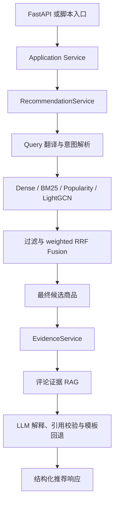
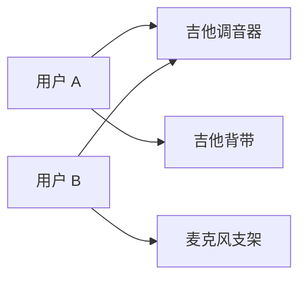

# CartWise 项目规划

## 1. 项目定位

CartWise 是一个基于 RAG 的可解释个性化电商导购系统，用于展示推荐系统、检索增强生成和在线服务化能力。

项目使用 Amazon Reviews 2023 的 `Musical_Instruments` 单品类数据。系统结合用户历史行为、当前自然语言需求、结构化约束和真实评论证据，返回带引用的 Top 5 商品推荐。当前 MVP 已完成推荐与 Evidence 服务层重构，下一步进入 FastAPI 与 Streamlit 接入。

项目不是让 LLM 自由生成商品，而是让不同组件承担明确职责：

- LightGCN：根据用户历史行为召回个性化候选。
- Dense + BM25：根据用户当前需求补充相关商品。
- 代码层过滤器：严格执行价格、品牌和属性约束。
- 评论证据 RAG：为最终商品检索真实评论。
- LLM：解析用户意图，并根据已有商品和证据生成中文解释。

## 2. 两周一期目标

在 10 个工作日内完成一个可在本机复现的最小完整闭环：

- 下载并处理乐器类数据，生成开发小样本和正式评估集。
- 实现 Popularity 基线和 LightGCN 推荐模型。
- 建立商品 Dense 与 BM25 混合检索。
- 实现价格、品牌、属性等硬过滤。
- 建立独立的评论证据索引。
- 接入 OpenAI-compatible LLM 适配层。
- 使用 FastAPI 提供单轮推荐接口，使用 Streamlit 提供中文演示页。
- 输出离线指标、引用准确性抽检结果和本机延迟报告。

一期当前不实现复杂 Agent、CrossEncoder、Redis、多轮会话、持久化会话存储、登录、数据库、复杂监控、高级前端功能和独立商品图模型。多轮需求更新、部署和复杂会话能力属于 MVP 后可选项。

## 2.1 当前 MVP 路线

结构重构已经完成，当前主要任务不再是重新调整目录，而是接入 API 与 UI：

1. FastAPI：实现 `/health/live`、`/health/ready` 和 `POST /api/v1/recommend`，通过 Application Service 调用正式推荐链路。
2. Streamlit：只通过 HTTP 调用 FastAPI，展示单轮推荐、证据和解释。
3. 端到端联调：验证中文 query、约束执行、Top 5、Evidence、LLM fallback 和 readiness。
4. 最终清理：在 API 与 UI 稳定后迁移旧 wrapper 调用方、精简 README、补充最终运行说明。

MVP 后可选项包括 Redis、多轮会话、复杂 Agent、CrossEncoder、共购图扩展、部署、登录、数据库和更复杂监控。

## 3. 数据集评估

### 3.1 数据选择

主数据集使用 Amazon Reviews 2023 的 `Musical_Instruments` 子集。

| 数据 | 规模 |
|---|---:|
| 原始评论 | 约 3.0M |
| 原始元数据商品数 | 约 213.6K |
| 官方 5-core 用户数 | 约 57.4K |
| 官方 5-core 商品数 | 约 24.6K |
| 官方 5-core 交互数 | 约 511.8K |
| Leave-Last-Out 训练 / 验证 / 测试 | 约 397.0K / 57.4K / 57.4K |

使用 `parent_asin` 作为统一商品主键。仅将 5-core 中出现的商品纳入一期可推荐目录，再从原始元数据和评论中补齐文本字段。

### 3.2 为什么适合本项目

该数据集能够支持：

- Popularity、BPR 和 LightGCN 等推荐模型。
- 使用 `user_id -> parent_asin` 构建用户-商品二部图。
- 使用标题、描述、特征和详情构建商品语义索引。
- 使用评论正文、评分、时间、购买验证和 helpful votes 构建证据索引。
- 使用价格和商品详情执行结构化过滤。
- 使用 `bought_together` 构建二期商品共购扩展。
- 使用官方时间划分避免未来数据泄漏。

### 3.3 数据限制

- 评论行为不等于完整购买行为，无法模拟真实曝光、点击、加购和购买漏斗。
- 数据集没有搜索日志，Dense/BM25 的查询召回效果需要额外建立测试集。
- 数据集没有真实导购对话，多轮需求需要自行设计验收用例。
- 部分商品可能缺少价格、描述或共购信息，需要生成字段覆盖率报告。
- `bought_together` 的有效边比例需要下载元数据后验证，再决定二期图扩展深度。

## 4. 系统架构



### 4.1 各组件职责

| 组件 | 解决的问题 |
|---|---|
| Popularity | 提供最低成本基线，并为冷启动用户兜底 |
| LightGCN | 根据用户历史交互学习个性化偏好 |
| Dense 检索 | 对比英文通用 E5 与英文电商领域 BLaIR，召回符合当前需求的商品 |
| BM25 检索 | 识别品牌、型号、接口和乐器名称等精确关键词 |
| 硬过滤器 | 确保价格、品牌和属性约束不会被排序模型绕过 |
| 评论证据 RAG | 为推荐理由和潜在缺点提供可追溯依据 |
| LLM 适配层 | 解析需求并将已验证事实组织为自然语言 |
| RecommendationService | 编排正式推荐链路，不加载重资源 |
| EvidenceService | 基于最终候选批量检索证据和生成解释 |
| Application Service | 串联推荐与证据服务，是未来 FastAPI 的业务入口 |

历史 `scripts/tools/run_stage8_smoke.py` 通过 `scripts/tools/stage8_smoke_adapter.py` 保留 Stage 8 search-only smoke 行为。该 adapter 不属于正式业务服务，FastAPI 不得调用。

### 4.2 候选融合

带自然语言 query 的导购推荐以 Dense 和 BM25 为主要搜索召回通道。LightGCN 和
Popularity 只提供个性化与热门度补充，不允许无条件绕过当前 query 相关性进入最终
候选池。

一期使用 weighted Reciprocal Rank Fusion 合并候选，默认权重为：

| 用户类型 | 候选权重 |
|---|---|
| 已知用户 | Dense `0.45`、BM25 `0.25`、LightGCN `0.25`、Popularity `0.05` |
| 冷启动用户 | Dense `0.65`、BM25 `0.30`、Popularity `0.05` |

这些权重属于一期默认值。实验完成后根据消融结果调整，并在报告中记录最终配置。

类目相关性使用受控的宽泛商品类型标签，例如 `microphone_stand`、`guitar_strings`
和 `tuner`。Dense 和 BM25 已根据原始 query 检索，不执行宽泛商品类型门控，避免
因标签覆盖不完整或同义词归一化不足误删有效搜索结果。

LightGCN 和 Popularity 与当前 query 无直接关系。只有当查询理解层能够高置信度解析
宽泛商品类型时，才允许将通过类型门控的 LightGCN 和 Popularity 候选补充到带 query
的候选池。如果无法高置信度解析类型，本轮只使用 Dense 和 BM25 候选。

细粒度形态和使用场景，例如 `boom_arm`、`desk_mounted`、`broadcast` 和 `podcast`，
保留给 Dense、BM25 和后续排序，不直接作为类目硬过滤条件。

### 4.3 硬过滤规则

- 有价格上限时，缺失价格的商品必须排除。
- 没有价格约束时，允许展示价格缺失商品，并标记为“价格缺失”。
- 排除品牌时，不允许返回对应品牌商品。
- `换一批` 时，不允许返回本会话已展示商品。
- 过滤后候选不足 5 个时，返回实际数量并提示用户放宽条件。
- 价格、品牌、排除品牌和可确认类目等明确约束必须由代码层执行。颜色和材料在一期先保留解析与过滤接口；对 Dense/BM25 搜索结果是否启用颜色和材料硬过滤，以阶段 7 人工测试结果为准。
- 宽泛商品类型门控仅限制 LightGCN 和 Popularity 补充候选，不对 Dense 和 BM25
  搜索结果执行字符串匹配式类目过滤。

## 5. 图推荐方案

### 5.1 一期：用户-商品二部图

使用训练集构建二部图：



- 节点：约 57.4K 用户和 24.6K 商品。
- 训练边：约 397.0K 条交互。
- 验证和测试边不得加入训练图，避免数据泄漏。
- 本机显卡为 GTX 1660 Ti 6GB，足够训练 LightGCN。
- 评估时采用分批计算，避免一次性构建完整用户-商品分数矩阵。

### 5.2 基础基线

必须实现 Popularity：

```text
score(item) = 训练集中与商品相关的交互次数
```

返回热门且用户未交互过的商品，并应用同样的硬过滤。它用于判断 LightGCN 是否真正提升了推荐效果。

时间允许时增加 BPR 作为可选基线，用于判断图传播是否带来额外收益。

### 5.3 二期：商品共购图

使用商品元数据中的 `bought_together` 建立商品-商品图。先统计：

- 非空商品比例。
- 有效边数量。
- 平均度数。
- 孤立节点比例。
- 共购邻居位于 5-core 商品目录内的比例。

二期先实现一跳邻居召回，不立即训练复杂异构 GNN。只有字段覆盖率和实验收益足够时，才考虑更复杂的图模型。

## 6. RAG 方案

### 6.1 两类索引必须分离

| 索引 | 用途 | 数据 |
|---|---|---|
| 商品索引 | 召回符合当前需求的商品 | 标题、描述、特征、详情、品牌、价格 |
| 评论证据索引 | 为最终商品生成可解释依据 | 评论正文、评分、时间、购买验证、helpful votes |

不能把评论证据检索与商品候选检索混为一体。先决定推荐哪些商品，再为入选商品检索证据。

### 6.2 Dense + BM25 混合检索

- E5、BLaIR 和 BM25 复用同一份基础商品文档。字段顺序固定为：

  ```text
  Title
  -> Brand
  -> Main Category
  -> Categories
  -> Features
  -> Details
  -> Description
  ```

- `main_category` 只作为检索文本，不用于清洗目录或执行硬过滤。
- Dense 编码时使用各模型 tokenizer 按模型 token 上限自动截断尾部内容，并记录
  token 长度分布、截断商品数和截断比例。不额外使用固定字符数截断。
- Dense 分别使用 `intfloat/e5-small-v2` 和
  `hyp1231/blair-roberta-base` 建立独立索引，完成零微调对比。
- E5 和 BLaIR 都以英文查询和英文商品文档作为主要处理对象。
- BLaIR 面向英文 Amazon Reviews 2023 商品检索，用于检查电商领域模型相对通用
  英文模型的收益。
- BM25 使用英文查询，匹配品牌、型号和明确术语。
- 两个商品 Dense 索引分别写入独立 Qdrant collection，BM25 建立本地持久化索引。
- 用户输入包含中文字符时，先调用 LLM 将查询直接翻译为英文，再进入相同的 Dense
  和 BM25 检索链路。翻译提示词保持简单，只返回英文译文，不做结构化输出或复杂改写。
- 英文查询不调用 LLM。翻译失败时明确报错，不静默回退到英文模型处理中文原文。
- 阶段 6 不接入 ESCI，不微调 Embedding 模型。使用少量人工编写的英文查询对比
  E5 和 BLaIR，选择一期默认 Dense 模型。
- 一期商品索引规模约 24.6K 条。

### 6.3 评论证据控制

- 每个商品默认最多保留 70 条文本非空评论作为证据候选，其中最多优先保留 14 条 `rating <= 3` 的中低评分评论。
- 其余评论优先保留已验证购买、helpful vote 较高和时间较新的评论。
- 该方案记为 `70-14`，作为一期默认评论证据容量。后续可在 `FUTURE_IMPROVEMENTS.md` 中对比 `50-10`、`100-20` 和 `all` 等方案。
- 同时保留中低评分评论，用于生成潜在缺点。
- Top 5 商品各自最多收集 5 条不同评论证据；同一评论命中多个 chunk 时保留命中 chunk，并优先补入 1 条中低评分评论用于支撑潜在缺点。
- 引用 ID 由评论关键字段生成稳定哈希。

### 6.4 防止 LLM 幻觉

- LLM 不允许增加候选列表以外的商品。
- 商品价格和属性必须来自元数据。
- 推荐理由和缺点必须基于商品字段或检索评论。
- 输出中的商品 ID 和引用 ID 必须再次校验。
- LLM 超时、无效 JSON 或伪造引用时，使用确定性模板回退。

## 7. 多轮交互

当前 MVP 先实现单轮推荐。多轮交互、Redis、长期记忆、复杂用户画像更新和多智能体会话编排全部放到 MVP 后。不要在 FastAPI 阶段提前引入 `session_id`、会话存储或反馈接口，除非用户明确调整当前阶段范围。

MVP 后可以考虑的操作：

| 操作 | 行为 |
|---|---|
| 新的明确约束 | 覆盖旧约束 |
| 排除品牌 | 追加到排除集合 |
| `换一批` | 保留当前约束，将本会话已展示商品追加到排除集合 |
| `更便宜` | 保留约束，将价格上限调整为上一批最低价格以下 |
| `不要这个品牌` | UI 按钮传入品牌；纯文本无法定位具体品牌时提示用户补充品牌名称 |

商品价格保留数据集中的美元值，界面使用 `$` 展示，不做动态汇率换算。

## 8. 技术栈与运行方式

| 层级 | 技术 |
|---|---|
| 推荐模型 | Popularity、LightGCN，BPR 可选 |
| 推荐框架 | PyTorch Geometric（PyG）LightGCN |
| 向量模型 | `intfloat/e5-small-v2`、`hyp1231/blair-roberta-base` |
| 向量库 | Qdrant Docker，临时兜底为 Qdrant 本地持久化模式 |
| 关键词检索 | BM25 |
| 后端 | FastAPI |
| 演示 UI | Streamlit |
| LLM | OpenAI-compatible API 适配层 |
| 实验记录 | CSV + Markdown |
| 环境 | Python 3.12，Docker Desktop |

### 8.1 本机环境约束

- 当前 Python 版本为 `3.12.9`。
- 当前虚拟环境仅安装 `pip`。
- 当前电脑尚未安装 Docker。
- 当前显卡为 GTX 1660 Ti 6GB。
- 下载依赖和数据时使用代理 `http://127.0.0.1:9508`。
- 实施前确认磁盘至少预留 10GB。

### 8.2 LightGCN 实现约束

阶段 5 使用 PyTorch Geometric（PyG）提供的
`torch_geometric.nn.models.LightGCN`，直接读取项目已有 Parquet 数据。
不因框架选择改变官方时间切分、指标口径和在线接口。

当前环境已验证 `torch==2.12.0+cu126` 和 `torch-geometric==2.7.0` 可以在 Python
`3.12.9`、CUDA `12.6` 和 `NVIDIA GeForce GTX 1660 Ti` 上完成 LightGCN 导入、
图传播、BPR loss、反向传播、训练、保存加载、Top K 推荐和分批评估。开发样本包含
`40,945` 个训练用户、`500` 个商品和 `101,713` 条训练交互。当前 LightGCN 路径
不需要额外安装 PyG 编译扩展。

训练脚本必须显式支持设备选择。请求 CUDA 但 CUDA 不可用时立即报错，不允许静默
回退到 CPU。保持数据集、指标和在线接口不变。

## 9. 对外接口

### 9.1 FastAPI

| 方法 | 路径 | 用途 |
|---|---|---|
| `GET` | `/health/live` | liveness，只表示进程存活 |
| `GET` | `/health/ready` | readiness，检查 Qdrant、模型、索引、LLM 配置和服务实例 |
| `POST` | `/api/v1/recommend` | 单轮自然语言需求，返回 Top K 推荐 |

推荐响应至少包含：

```json
{
  "applied_constraints": {},
  "recommendations": [
    {
      "parent_asin": "...",
      "title": "...",
      "price_usd": 29.99,
      "score": 0.0,
      "candidate_sources": ["lightgcn", "dense", "bm25"],
      "reasons": ["..."],
      "caveats": ["..."],
      "evidence": [
        {
          "review_id": "...",
          "rating": 4.0,
          "excerpt": "..."
        }
      ]
    }
  ]
}
```

FastAPI 请求 schema 只暴露 `query`、可选 `user_id` 和 `top_k` 等当前后端已有能力，不暴露 smoke、debug、mode 或内部算法参数。路由层不得直接调用 Dense、BM25、LightGCN、Popularity、Fusion、Qdrant 或 LLM，必须通过 Application Service。

### 9.2 Streamlit

页面使用中文，商品标题与评论摘录保留英文原文：

- 演示用户选择器和冷启动模式。
- 对话输入框。
- 当前约束展示。
- Top 5 商品卡片。
- 推荐理由、潜在缺点、评论证据和召回来源。
- 单轮推荐结果展示。`换一批`、`更便宜`、`排除该品牌` 等快捷操作属于 MVP 后，除非后端已实现对应接口。
- 简单耗时展示。

默认不主动打开网页预览，仅在最终 UI 验收或排查交互问题时使用浏览器。

## 10. 建议仓库结构

```text
cartwise/
  application/      # 顶层业务编排，FastAPI 应调用这里
  api/              # FastAPI 路由和请求响应模型
  catalog/          # 商品文档构造等 catalog 共享逻辑
  core/             # 当前保留配置和兼容 wrapper
  evidence/         # 评论证据 RAG 与 EvidenceService
  query/            # Query 翻译、意图解析和约束类型
  recommendation/   # RecommendationService
  retrieval/        # LightGCN、Popularity、Dense、BM25、过滤、Fusion
  ui/               # Streamlit
scripts/
  pipeline/         # 可重复执行的下载、清洗、建索引、训练、评估流程
  tools/            # 人工检查与调试工具
  experiments/      # 当前阶段之外的探索脚本
tests/              # 单元测试和集成测试
artifacts/          # 可再生成的索引报告、分析报告和预览，不提交 Git
reports/metrics/    # 提交 Git 的 CSV 实验指标
docker-compose.yml  # Qdrant
.env.example        # 不包含真实密钥
README.md
```

脚本从仓库根目录使用模块方式运行，例如：

```powershell
.\.venv\Scripts\python.exe -m scripts.pipeline.preprocess_amazon_reviews
.\.venv\Scripts\python.exe -m scripts.pipeline.train_lightgcn --scope full
.\.venv\Scripts\python.exe -m scripts.pipeline.build_product_dense_index --scope full
.\.venv\Scripts\python.exe -m scripts.pipeline.build_product_bm25_index --scope full
.\.venv\Scripts\python.exe -m scripts.tools.audit_retrieval --scope full --channels e5
.\.venv\Scripts\python.exe -m scripts.tools.audit_retrieval --scope full --channels blair
.\.venv\Scripts\python.exe -m scripts.tools.audit_retrieval --scope full --channels bm25
```

统一召回审核工具支持连续输入 `query-id <ID>`、`query <文本>` 或 `user <用户 ID>`，
在同一进程中复用已加载模型。人工测评查询清单保存在
`artifacts/reports/manual_testing/retrieval_audit_queries.json`。每轮 query 审核报告分别保存到
`artifacts/reports/retrieval_audit/<scope>/` 下的可评分 HTML 和 JSON 文件，并可从
HTML 导出评分 CSV。

原始数据、处理后数据、模型权重、向量索引和真实密钥不得提交 Git。

## 11. 后续阶段安排

| 阶段 | 工作内容 | 验收 |
|---|---|---|
| FastAPI | 实现 schema、依赖注入、`/health/live`、`/health/ready`、`POST /api/v1/recommend`，接入 Application Service | API 测试覆盖正常请求、非法输入、fallback 和 readiness |
| Streamlit | 实现只通过 HTTP 调用 FastAPI 的中文演示页 | 可展示 Top K、约束、来源、证据和解释 |
| 端到端联调 | 使用真实模型、索引、Qdrant 和 LLM 跑通 API + UI | 中文 query、约束、证据和 fallback 均可验证 |
| 最终清理 | 整理 README、迁移 wrapper 调用方、补充最终报告和限制说明 | 新对话可根据 README 和文档继续开发 |

## 12. 验收标准

### 12.1 功能场景

1. 已知用户：`推荐 50 美元以内、适合初学者的吉他调音器，不要 Fender。`
2. 冷启动用户：`推荐适合家庭录音的便携麦克风支架。`
3. 无结果场景：约束过严时返回明确提示，不返回违反约束的商品。
4. LLM 故障场景：超时、无效 JSON 和伪造引用均触发回退。
5. API readiness：重资源未准备好时能返回可诊断状态。

### 12.2 自动化测试

- 数据处理：主键关联、去重、时间划分、缺失价格处理。
- 过滤器：价格边界、品牌排除、已展示商品排除。
- 融合排序：候选来源为空、重复商品、冷启动。
- 证据引用：引用属于对应商品，并且来自检索结果。
- API：正常请求、非法输入、LLM fallback、Qdrant 或重资源不可用。
- 冒烟测试：使用小样本完成建索引、启动 API 和请求 Top 5。

### 12.3 实验报告

一期至少完成：

| 实验 | 用途 |
|---|---|
| Popularity | 最低成本基线 |
| LightGCN | 验证个性化图推荐增益 |
| LightGCN + Dense/BM25 + 硬过滤 | 最终一期链路 |

正式记录：

- `Recall@10`
- `NDCG@10`
- `HitRate@10`
- 本地推荐检索链路 P50、P95 延迟
- 包含外部 LLM 的端到端 P50、P95 延迟
- 50 个推荐结果的引用准确性人工抽检

## 13. 二期增强路线

按以下顺序继续：

1. 统计并接入 `bought_together` 共购图一跳扩展。
2. 加入轻量 CrossEncoder，对较小候选集执行重排。
3. 增加冷启动分桶分析。
4. 使用人工编写的英文查询检查 Dense、BM25 和混合检索效果，并保留少量中文输入验证
   LLM 翻译链路。
5. 对比有无 Dense、BM25、共购扩展和重排的消融实验。
6. 将会话状态迁移到 Redis。
7. 评估 `BGE-M3` 等更强嵌入模型。
8. 视需要部署公网 Demo。

## 14. 求职展示重点

该项目适合用于申请大模型应用、RAG、搜索推荐和初级推荐算法岗位。竞争力来自完整且可验证的系统设计，而不是组件数量。

简历和面试中重点展示：

- 为什么单独使用协同过滤无法处理即时自然语言需求。
- 为什么单独使用 RAG 无法充分利用长期用户偏好。
- 为什么商品候选索引与评论证据索引必须分离。
- 为什么硬约束必须由代码执行，而不是交给 LLM。
- LightGCN 相比 Popularity 的真实指标提升。
- 引用校验、模板回退和延迟报告。
- 共购图、重排和冷启动分析作为清晰的二期路线。

一期完成后，简历描述中的指标必须使用真实实验结果：

> 基于 Amazon Reviews 2023 乐器类 5-core 数据构建个性化导购系统，在约 51 万条交互上训练 LightGCN；融合 Dense/BM25 混合召回、结构化硬过滤和评论证据 RAG，实现中文自然语言导购与可追溯推荐解释。相较 Popularity 基线，Recall@10 提升 `X%`；评论引用一致性达到 `Y%`；本地检索链路 P95 延迟为 `Z ms`。

## 15. 风险与约束

- 当前 Git 仓库存在 ownership 警告，实施时确认目录来源后处理 safe-directory 配置。
- 当前电脑尚未安装 Docker，首日需要完成安装验证。
- 阶段 5 开始前需要验证 PyG 与 CUDA 版 PyTorch 的兼容性；请求 CUDA 但不可用时禁止静默回退到 CPU。
- 禁止批量删除文件或目录。需要清理大量数据时，由用户手动执行。
- 真实 API 密钥只能放入未提交的 `.env` 文件。
- 两周内优先完成可测闭环，不引入复杂多智能体架构。

## 16. 参考资料

- [Amazon Reviews 2023 官方数据页](https://amazon-reviews-2023.github.io/main.html)
- [Amazon Reviews 2023 官方 5-core 与时间划分页](https://amazon-reviews-2023.github.io/data_processing/5core.html)
- [Amazon Reviews 2023 官方仓库](https://github.com/hyp1231/AmazonReviews2023)
- [Qdrant 本地 Docker 快速开始](https://qdrant.tech/documentation/quick-start/)
- [Qdrant Python Client Quickstart](https://python-client.qdrant.tech/quickstart.html)
- [e5-small-v2 模型卡](https://huggingface.co/intfloat/e5-small-v2)
- [blair-roberta-base 模型卡](https://huggingface.co/hyp1231/blair-roberta-base)
- [PyTorch Geometric LightGCN 文档](https://pytorch-geometric.readthedocs.io/en/latest/generated/torch_geometric.nn.models.LightGCN.html)
